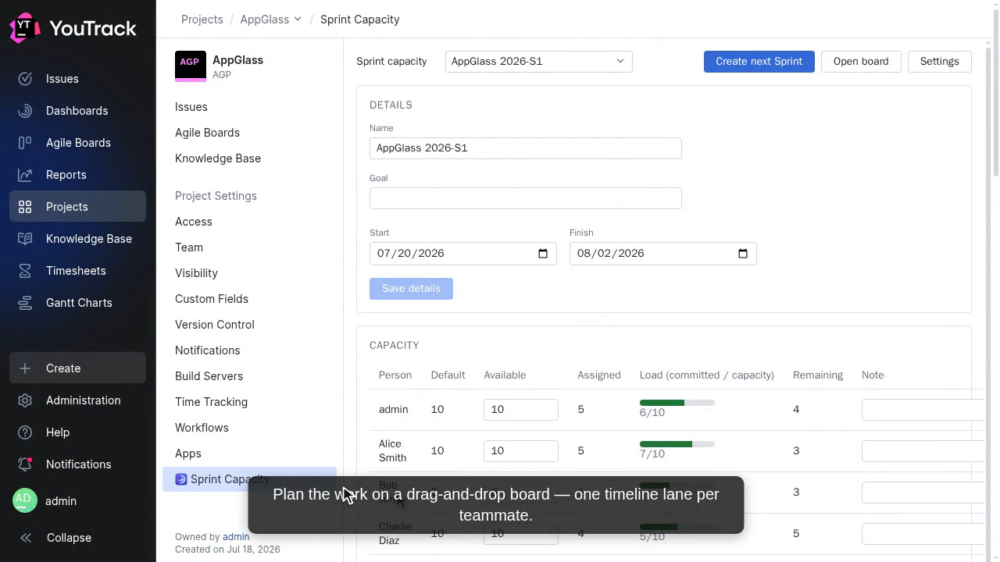

# Sprint Capacity Planner

> Capacity planning, computed delivery metrics, and one-click next-Sprint — layered on **native** YouTrack Sprints.

A YouTrack App that adds **capacity planning, computed delivery metrics, and a one-click "create next Sprint" button** on top of *native* YouTrack Sprints. The native Sprint stays the single source of truth — the app only layers planning data and calculations over it, so your board, issues, and fields are never forked or duplicated.

## See it in action

**▶ [Watch the demo](docs/media/demo.mp4)** — add the app to a project and configure it, then plan a Sprint on the drag-and-drop board and open any card in YouTrack's own issue view. Also available separately: **[install & configure](docs/media/install.mp4)** · **[walkthrough](docs/media/walkthrough.mp4)**. The videos are recorded automatically against a real YouTrack.

> 📦 **JetBrains Marketplace:** _listing coming soon._

## Features

- **Per-person capacity planning** per Sprint (working-days × hours, with part-time allocations and per-row overrides).
- **Drag-and-drop planning board** — pull issues from a configurable backlog onto teammate lanes, leave work unassigned, or drag it back; over-capacity is highlighted.
- **Computed metrics** — capacity (raw/planned/remaining) and effort (original/current/completed), plus missing-effort warnings.
- **Learned Focus Factor** — observed per completed Sprint, auto-calibrated with bounds.
- **One-click next Sprint** — computed name, dates, sequence, seeded capacity, and optional carry-over.
- **Manager diagnostics + export/import** — a data-health view and a versioned JSON backup bundle.

It deliberately does **not** create service/placeholder issues, track committed scope, or add locks/approval gates. See [`docs/JIRA_ALIGNMENT.md`](docs/JIRA_ALIGNMENT.md) for how the model maps onto Jira.

## Install

Requires YouTrack **2024.3+** (Cloud or Server).

1. Download `sprint-capacity-planner.zip` from a [release](https://github.com/ndkoval/yt-sprint-planner-plugin/releases) (or build it: `npm ci && npm run build && npm run pack`).
2. In YouTrack: **Administration → Apps → Import app**, upload the ZIP.
3. Attach the app to a project, then open its **Sprint Capacity** tab → **Settings** to pick the board, effort fields, backlog query, and team.

> **Before uninstalling:** all app data lives in `scp*` extension properties and is removed on uninstall (native Sprints/issues are untouched). Export a backup bundle from the manager diagnostics first.

## Documentation

- [`ARCHITECTURE.md`](ARCHITECTURE.md) · [`DATA_MODEL.md`](DATA_MODEL.md) · [`WORKFLOWS.md`](WORKFLOWS.md) · [`SECURITY.md`](SECURITY.md) — design, persisted shapes, workflow rules, and the permission matrix.
- [`AGENTS.md`](AGENTS.md) — **development, testing, and demo-recording guide** (build/test commands and the real-YouTrack policy).
- [`CHANGELOG.md`](CHANGELOG.md) — release notes.

## Status

Verified end-to-end against real YouTrack **2025.3** (install/attach, per-project config, the drag-and-drop planner, one-click next Sprint, native issue view, and the demo reels), reproduced in [CI](.github/workflows/ci.yml). Known limitations are tracked as [`known-limitation`](https://github.com/ndkoval/yt-sprint-planner-plugin/issues?q=is%3Aissue+label%3Aknown-limitation) issues.

## Contributing

Issues and pull requests are welcome. Run `npm run test:all` before opening a PR — see [`AGENTS.md`](AGENTS.md).

## License

Licensed under the **[Apache License 2.0](LICENSE)**. © 2026 Nikita Koval.
